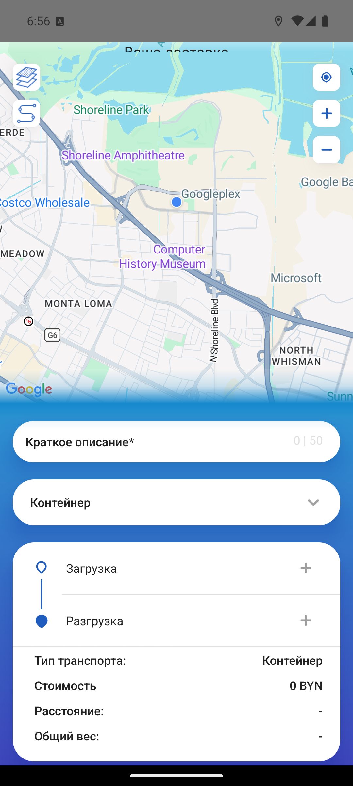
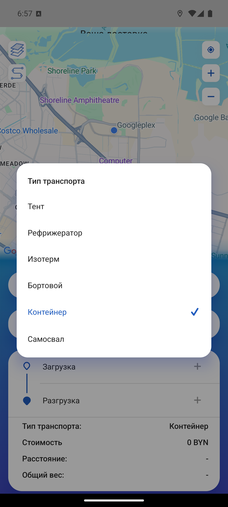

# CargoRadar Test Task

Тестовый проект для кандидатов на позицию разработчика JavaScript / React Native.

Проект представляет собой мобильное приложение CargoRadar на React Native.

Задача кандидата — запустить проект, разобраться в структуре кода и внести небольшое изменение в форму создания заявки.

---

## ✅ Решение (кандидат)

### Что сделано
Добавлен выпадающий список **«Тип транспорта»** в форму создания заявки (`CreateTenderScreen`).
Значения: Тент, Рефрижератор, Изотерм, Бортовой, Контейнер, Самосвал.

- `src/store/features/addTenderSlice.js` — поле `transportType` в состоянии формы (`tender.data`),
  обработка в редьюсере `setInfoTender`, сброс в `onResetTender`.
- `src/screens/CreateTender/CreateTenderScreen.js` — список значений `TRANSPORT_TYPES`,
  сохранение выбора в Redux, карточка-триггер с выпадающим списком (`Modal`),
  отображение выбранного значения на триггере и в сводке, передача в объект заявки при создании.

Без новых зависимостей — дропдаун собран на `Modal` + `TouchableOpacity` в стиле существующей формы.

### Скриншоты

<p align="center">
  
  
  
</p>

### Команда запуска
```bash
yarn install
yarn start
yarn android
```
Проверено на Android-эмуляторе `Pixel_API36` (Android 14 / API 36, x86_64).

### Ошибки при запуске и как решены
Окружение было «пустое» и слабое (7 ГБ ОЗУ, переполненный диск `C:`), поэтому:

- **Пустое окружение** — доустановил JDK 17, Android command-line tools, создал эмулятор, поставил `yarn`.
- **Переполненный диск `C:` + отсутствие NDK 26** (нужен `react-native-reanimated`) — перенёс кэш Gradle и NDK на диск `D:`, подключил NDK через `ndk.dir` в `local.properties`.
- **Ошибка нативной сборки** `mkdir ... No such file or directory` (лимит длины пути Windows 260) — собирал с укороченного пути через `subst`.
- **Нет `google-services.json`** (Firebase) — добавил placeholder с корректным package `com.cargoradar.main`.
- **Слабая машина** — отключил Jetifier, собирал только под `x86_64`, добавил ретраи загрузки зависимостей в `gradle.properties`.

> Примечание: правки в `android/gradle.properties`, `android/local.properties` и `android/app/google-services.json` — локальные обходы окружения и **не входят** в изменения фичи.

---

## Что нужно сделать

Подробное описание задания находится в файле:

`TEST_TASK.md`

## Запуск проекта

Установить зависимости:

```bash
yarn install
# OR using Yarn
yarn ios
```

If everything is set up _correctly_, you should see your new app running in your _Android Emulator_ or _iOS Simulator_ shortly provided you have set up your emulator/simulator correctly.

This is one way to run your app — you can also run it directly from within Android Studio and Xcode respectively.

## Step 3: Modifying your App

Now that you have successfully run the app, let's modify it.

1. Open `App.tsx` in your text editor of choice and edit some lines.
2. For **Android**: Press the <kbd>R</kbd> key twice or select **"Reload"** from the **Developer Menu** (<kbd>Ctrl</kbd> + <kbd>M</kbd> (on Window and Linux) or <kbd>Cmd ⌘</kbd> + <kbd>M</kbd> (on macOS)) to see your changes!

   For **iOS**: Hit <kbd>Cmd ⌘</kbd> + <kbd>R</kbd> in your iOS Simulator to reload the app and see your changes!

## Congratulations! :tada:

You've successfully run and modified your React Native App. :partying_face:

### Now what?

- If you want to add this new React Native code to an existing application, check out the [Integration guide](https://reactnative.dev/docs/integration-with-existing-apps).
- If you're curious to learn more about React Native, check out the [Introduction to React Native](https://reactnative.dev/docs/getting-started).

# Troubleshooting

If you can't get this to work, see the [Troubleshooting](https://reactnative.dev/docs/troubleshooting) page.

# Learn More

To learn more about React Native, take a look at the following resources:

- [React Native Website](https://reactnative.dev) - learn more about React Native.
- [Getting Started](https://reactnative.dev/docs/environment-setup) - an **overview** of React Native and how setup your environment.
- [Learn the Basics](https://reactnative.dev/docs/getting-started) - a **guided tour** of the React Native **basics**.
- [Blog](https://reactnative.dev/blog) - read the latest official React Native **Blog** posts.
- [`@facebook/react-native`](https://github.com/facebook/react-native) - the Open Source; GitHub **repository** for React Native.
